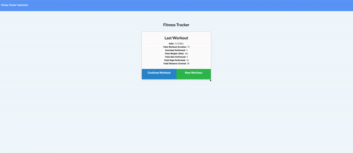

# Fitness Tracker
  
## Description
This app will allow the user to create and track daily workouts. The user will be able to log multiple exercies on any given day. They will also be  able to enter the name, type, weight, sets reps and duration of an exercise.
## Table of Contents 
- [Installation](#installation)
- [Usage](#usage)
- [License](#license)
- [Contributors](#contributors)
- [Testing](#test)
- [Questions](#questions)
## Installation
The following the dependecis should be installed: 1) Express 2) Mongoose 3) Morgan
## Usage
- 
- [Click](https://floating-citadel-88773.herokuapp.com/) this link to use the deployed app. Happy workout! 
## License
This application is under the MIT license.  
## Contributors
n/a.
## Testing
This application was tested using This application was tested using Insomnia and local browser
## Questions
For more information, please visit [GitHub Profile](https://github.com/agonzalvez/).  
For any questions, you may email me at agonzalvez1@gmail.com.